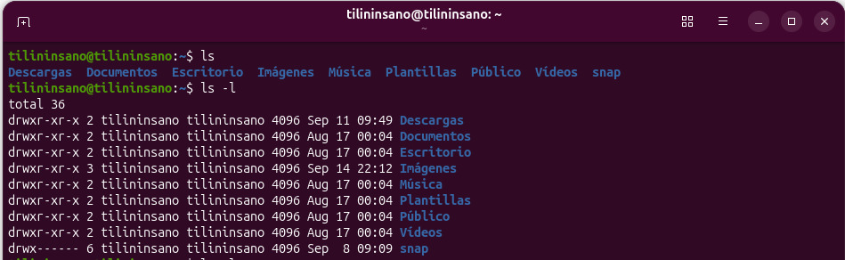
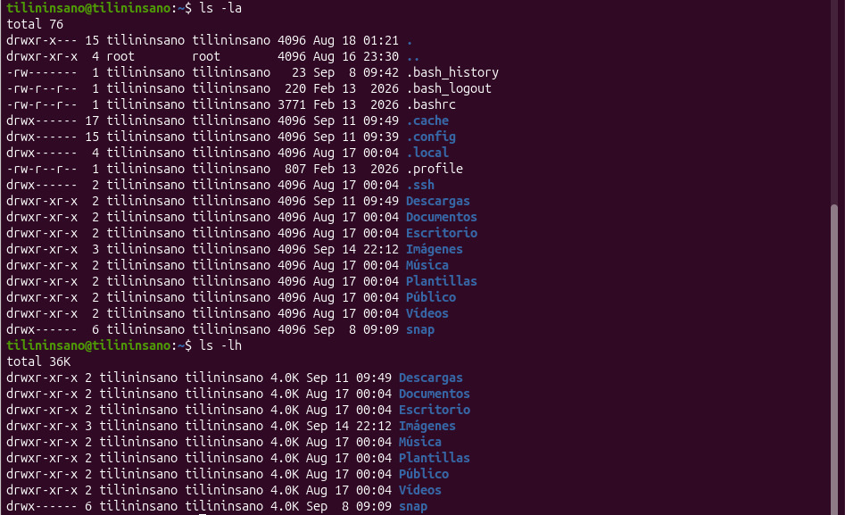

# Practicas_SO

- Se utilizaron comandos básicos de Linux para visualizar el contenido de las carpetas.
- Se practicó el uso de `ls` con diferentes opciones para mostrar información detallada, archivos ocultos y tamaños de forma legible.
- Se utilizó `cd` para entrar a carpetas y navegar entre diferentes niveles de directorios.
- Se practicó `cd ..` para subir un nivel y `cd ~` o `cd` para regresar a la carpeta personal.

## Imágenes de la práctica

Las siguientes imágenes muestran el desarrollo de la práctica y los comandos utilizados.

### 1. Primera imagen

### 2. Segunda imagen

### 3. Tercera imagen

